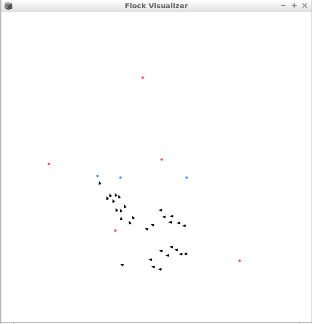

# Boids Classes

Repo for 2- and 3D optimized versions of Reynolds' boids algorithms. Also included in an N-dimensional implementation that is not optimized.

## Dependencies

My fork of [VectorSpace](https://github.com/woolgathering/VectorSpace).

## What does it look like?

Looks like this when projected in two dimensions:

Black wedges are the agents, blue circles are "targets", red circles are "obstacles".

### To Do
- Allow for different gravities in different dimensions (gravity or repulsion along a line)
